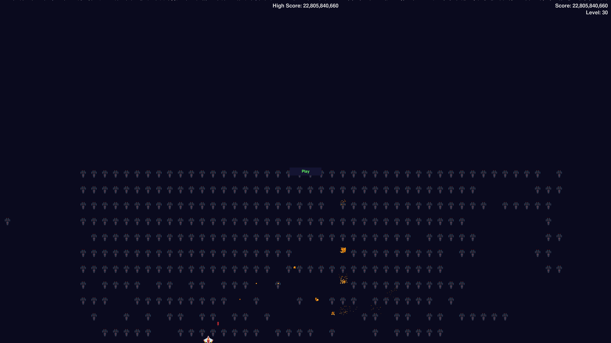

# Alien Invasion Game

A classic space shooter game built with Pygame. Defend Earth from alien fleets and achieve the highest score!



## Installation

### Prerequisites

- Python 3.7+

1. Clone/download the repository
2. Install dependencies:

```bash
pip install -r requirements.txt
```

## How to Play

### Running the Game

```bash
python alien_invasion.py                      # fullscreen
python alien_invasion.py --windowed           # 1200x800 window
python alien_invasion.py --windowed 800x600   # custom window size
python alien_invasion.py --player Ace --difficulty hard
python alien_invasion.py --list-players       # show saved players, then exit
python alien_invasion.py --delete-player Ace  # remove a player, then exit
```

`--player` creates the player if they don't exist yet.

### Controls

| Key       | Action                           |
| --------- | -------------------------------- |
| **← →**   | Move spaceship left/right        |
| **SPACE** | Toggle auto-fire on/off           |
| **P**     | Pause/Unpause game               |
| **M**     | Mute/Unmute sound                |
| **ENTER** | Start new game                   |
| **Q**     | Quit game (saves your progress)  |

On the start screen you also manage players:

| Key       | Action                                              |
| --------- | --------------------------------------------------- |
| **N**     | New player (type a name, ENTER to confirm, ESC cancels) |
| **TAB**   | Switch to the next player                           |
| **D**     | Cycle difficulty: normal → hard → easy              |
| **DEL**   | Delete the current player                           |

## Game Features

- 🚀 Progressive difficulty: Speed increases with each level, at a steady 60 FPS
- 🖥️ Fullscreen or windowed (`--windowed`)
- 💥 Explosion effects for alien/ship destruction
- 🔊 Sound effects and background music
- 🌟 Starry animated background
- 👥 Player profiles: each player keeps their own high score, best level, games played and difficulty
- 🎚️ Three difficulties: easy, normal (the original balance) and hard
- 🏆 Top-pilots leaderboard on the start screen
- ⏸️ Pause functionality and a mute toggle

Profiles live in `profiles.json` next to the game. An older `high_score.txt`
is imported once into the first profile.

## Tests

```bash
python -m pytest tests/ -v          # headless, no display or audio needed
python tests/coverage_report.py     # line coverage per module (stdlib only)
```

## Troubleshooting

1. If sounds don't play:
   - Ensure `.wav/.ogg` files exist in `sounds/`
   - Check system volume/mute status
2. If missing images:
   - Verify ship and alien images exist in `images/`
3. On Linux systems, install SDL dependencies:

```bash
sudo apt-get install python3-dev libsdl2-dev libsdl2-image-dev libsdl2-mixer-dev
```

Destroy alien waves, survive as long as possible, and top the leaderboard! 👾🛸